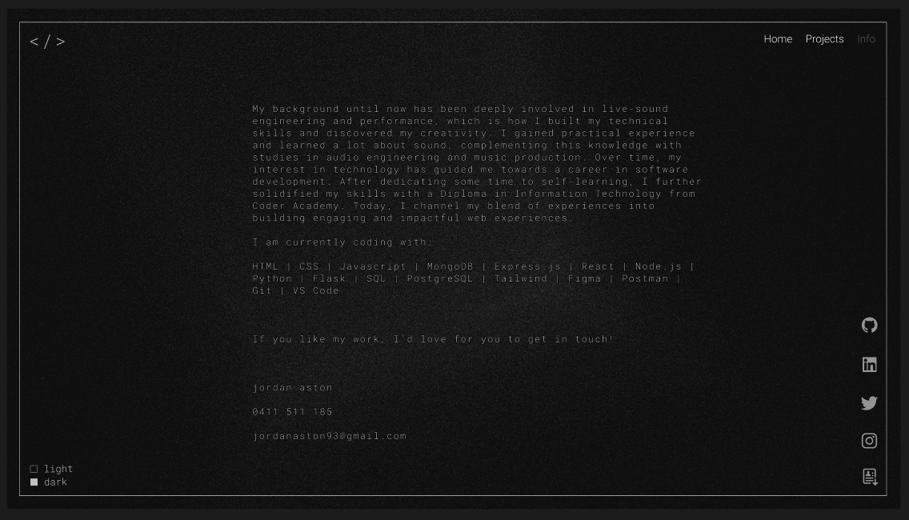

# Personal Developer Portfolio

 

### Showcases my most recent and notable work.

### Built with React and Tailwind.

### Deployed With Netlify

[Visit the site here!](https://jordanaston.io)

 

## Tech Stack

- JavaScript 
- React
- Tailwind

 

## Built With
- Vite
- Three.js
- EmailJS
- <a href="https://www.flaticon.com/free-icons/burger-menu" title="burger menu icons">Burger menu icons created by WR Graphic Garage - Flaticon</a>

 

## Wireframes designed with Figma

   
   
   
   
   
   

